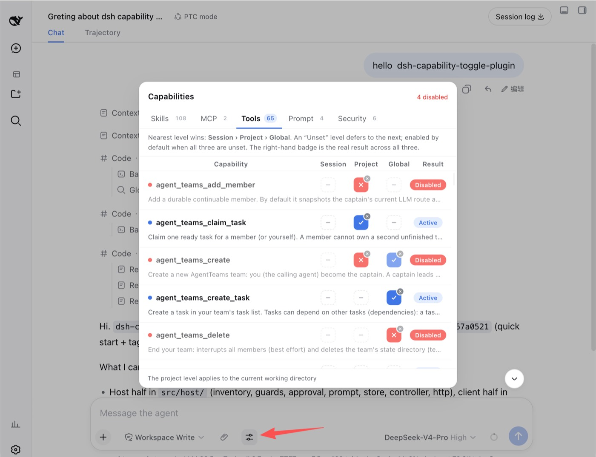

<div align="center">

# dsh-capability-toggle-plugin

**Turn individual agent capabilities on and off from the DSH WebUI composer — and have it actually enforced.**

[](#quick-start)

[](./LICENSE)


**English** · [简体中文](./README.zh-CN.md)



<sub>Three switches per row — session, project, global. Blue check = on · red cross = off · dashed dash = unset.<br>The small badge on a set switch clears it; the right-hand badge is the resolved result.</sub>

</div>

---

## What it is

A composer-row control for the **DeepSeek Harness (DSH) WebUI**. While the agent is idle, open the popup and switch individual **skills, MCP servers, tools, prompt injections, the approval gate, and safety guards** on or off — independently at the **session**, **project**, or **global** level.

Disabling something is not a cosmetic filter. A disabled capability **really disappears** from the model's tool schema set and skill catalog on the agent's next step, and a forced call is **hard-refused**.

| | |
| --- | --- |
| 🎛️ **Five tabs, six families** | `Skills` · `MCP` · `Tools` · `Prompt` · `Security` |
| 🧭 **Three levels per row** | session › project › global › default (enabled) |
| 🔒 **Real enforcement** | removed from the schema set, not hidden in the UI |
| ⚡ **Takes effect next step** | no session restart |
| 🌐 **Bilingual** | zh-CN + en, follows the WebUI language |

## Quick start

Install into your DSH profile at a pinned tag — one command:

```bash
dsh plugin --profile web add github:lifeopsgo/dsh-capability-toggle-plugin#v0.1.0
```

Restart the GUI, then refresh the page:

```bash
dsh --profile web web
```

The control appears in the composer row next to the ➕ button. Click it while the agent is idle.

> **That is it.** `dsh plugin` forwards to pnpm in the profile directory, then reconciles `dsh.profile.bundles` for you — a package declaring `dsh.bundle` (this one does) joins the layer stack automatically. No manual `package.json` editing.

<details>
<summary><b>Notes &amp; other commands</b></summary>

<br>

- **Pin a tag** — replace `v0.1.0` with the tag you want; see [releases](https://github.com/lifeopsgo/dsh-capability-toggle-plugin/releases). Use `#main` to track the branch instead.
- **`--profile web`** is the usual profile for the Web GUI; substitute your own name if it differs.
- **No build step** — the tag ships a prebuilt `lib/`, so installing runs no `prepare` script. You will not hit pnpm's build-approval prompt (`allowBuilds`) that git-hosted plugins otherwise require.

```bash
# upgrade to another tag
dsh plugin --profile web add github:lifeopsgo/dsh-capability-toggle-plugin#v0.2.0

# remove
dsh plugin --profile web remove dsh-capability-toggle-plugin
```

</details>

## Features

### The three-level model

Every capability exposes a `session`, `project`, and `global` switch, each either **on**, **off**, or **unset**.

```
session  ›  project  ›  global  ›  default (enabled)
```

The nearest level that is *set* wins; an **unset** level defers to the next one down. With all three unset, the capability stays enabled. The badge at the row's end always shows the **resolved** result across all three levels — so you never have to compute precedence in your head.

A switch shows only its current stance: click to flip **on ↔ off**, or hit the small clear badge to return it to **unset**.

### The six capability families

| Family | Tab | One row is | Notes |
| :-- | :-- | :-- | :-- |
| `skill` | Skills | One model-invocable skill | Disabling shadows it with a same-named `modelInvocable:false` skill |
| `mcp` | MCP | One MCP **server** (`mcp__<server>__*` collapses into one switch) | Denies every tool that server exposes; the row expands to list its member tools |
| `tool` | Tools | One model-visible tool | Also hides that tool's `tool:<name>` guidance section — saves tokens, avoids "tool gone, guidance still there" |
| `prompt` | Prompt | One gateable system-prompt injection point | A **curated allowlist**, probed for real presence: absent injection points show no switch |
| `approval` | Security | The approval-escalation gate (singleton) | Off ⇒ every approval request from this agent is auto-rejected. Independent of the system `/permission` setting |
| `guard` | Security | One opt-in safety preset | **Default off.** On ⇒ the guard acts on matching calls |

### How enforcement actually works

All five seams act on the **agent's own scope**, filtering the capability surface it inherits. Nothing global is mutated, and everything is restored when the agent is released.

| Family | Mechanism | Result |
| :-- | :-- | :-- |
| `tool` / `mcp` | `ctx.tools.restrict({ deny })` on the agent's scope | The tool leaves the model's schema set; `request/header` snapshots stop listing it; a forced call is refused |
| `skill` | A same-named `modelInvocable:false` runtime skill shadows the real one | The skill vanishes from `<available_skills>`; the `skill` tool's `isModelInvocable` check fails and throws |
| `prompt` | A same-named **empty-text** `systemPrompt.section` / `.context` shadow, or `suppressRuntimeContext()` | The section is overridden during assembly and dropped at render; the owning service keeps running — only what the model is *told* changes |
| `approval` | A scoped `approval/request` listener resolving `'rejected'` | Every approval request from this agent is denied deterministically, without touching the deployment's shared policy |
| `guard` | A `tools/pre-execute` listener matching the preset's predicate | `Block` refuses the call outright; `Confirm` raises one approval prompt and proceeds only if allowed |

### Security tab

**Approval escalation** (default **on**) — lets this agent raise actions that need your approval. Turn it off and every approval request from this agent is auto-rejected: no prompt, no elevation. Independent of the system `/permission` setting.

**Guard presets** (default **off**, opt-in). A guard reads inverted from the other families: *on* means **protection is active**, so its badge reads *Guarding* when it is doing something.

| Guard | Action | Catches |
| :-- | :-- | :-- |
| Read-only mode | 🚫 Block | Every file write / create / edit — the agent can read but not change files |
| Protect secrets | 🚫 Block | Any read, write, or shell command touching `.env`, `*.pem`, `id_rsa`, credentials, `.ssh/` |
| Confirm dangerous shell | ⚠️ Confirm | `rm -rf`, `dd`, `mkfs`, `chmod 777`, `curl \| sh`, fork bombs |
| Confirm destructive git | ⚠️ Confirm | `push --force`, `reset --hard`, `clean -fd`, `branch -D` |
| Confirm outbound network | ⚠️ Confirm | `web_search`, `read_page`, `curl`/`wget`, `git push`, `npm publish` |

`Block` guards are evaluated before `Confirm` guards, so a blocking rule always wins over a confirmation prompt.

### Prompt tab

The system-prompt registry exposes many entries, but most are unsafe to blank. This plugin gates only a curated few, and probes the live assembly so a switch appears **only when your deployment actually registered that entry**:

- **`deployment:persona`** — the order-0 persona section; empty text is a documented first-class state.
- **`sandbox:policy` / `approval:policy`** — the runtime-context snapshots that *tell the model* the sandbox mode and approval policy. Gating changes only what the model is told; the owning services still enforce for real.
- **Hide all runtime context** — one coarse switch for this scope.

Deliberately **excluded**, because blanking them breaks the model or the render: `harness:identity` (identity foundation), `tools:code-only` / `tools:sdk` (critical to the code-mode protocol), and the strict interpolation variables `provider` / `model` / `cwd`.

### Behaviour details

- **Locked while running** — every switch is read-only while the agent works (`session.running`); toggles apply when it goes idle.
- **Survives popup close and turn boundaries** — state lives in a settings namespace and the Host caches the last-known inventory, so reopening the popup between turns still shows disabled state correctly.
- **Framework-contract self-check** — the seams this plugin binds to are asserted at activation and printed as one greppable banner line. If a host event is ever renamed, enforcement would **fail open** and silently stop — the most dangerous direction — so it is made observable.

---

<div align="center">
<sub>MIT — see <a href="./LICENSE">LICENSE</a></sub>
</div>
